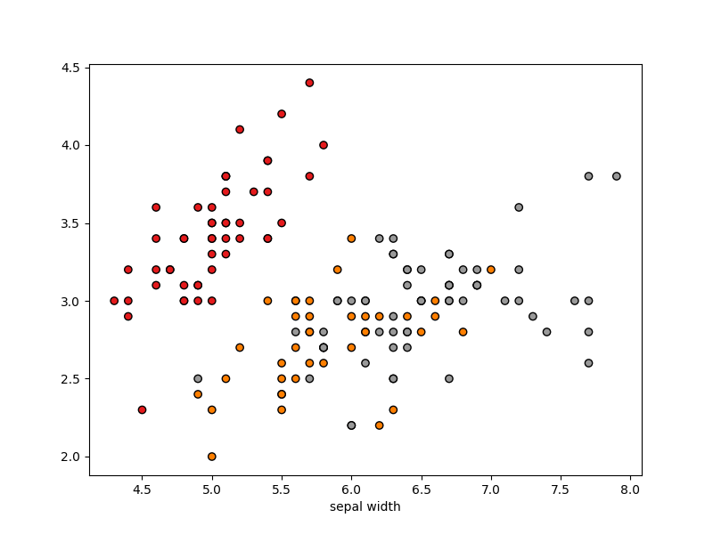
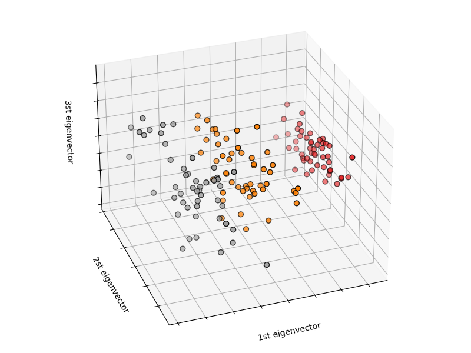
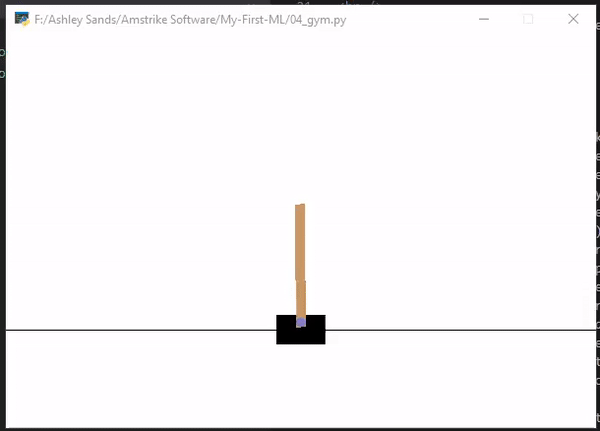

## Getting to know some basic Machain Learning AI frameworks 
#### Entry: , Published: 

| 
[Return to index](../)
| 

To begin, getting know some of the AI frameworks available in Python, we were given some tutorials using some of the example datasets available in scikit-learn [[1](#c1)]. Most notably the classic iris dataset. Furthermore, this demonstrated splitting the data in to a training and test set necessary for testing the fitness of the model once training is complete, which in turn encouraged us to underfitting/overfitting [[2](#c2)] our ML models. Lastly it taught me about displaying the data in different plots using matplot Python Library [[3](#c3)], which can be used to help understand the classification of the images [[Fig. 1, Fig. 2](#f1)] and recognize underfitting and overfitting. To be honest this was relatively straight forwards to follow along with and we swiftly moved onto Open Ai Gym [[4](#c4)] and stable_baseline3 [[5](#c5)]

 
[Fig. 1. 2D plot of the iris dataset, showing the separation between the three different classification groups. which is not very cleat for two of the group]

 
[Fig. 2. 3D plot of the iris dataset, making it much clearer to see the separation between the three classification groups]

 

OpenAi Gym is a framework (or toolkit) for developing and comparing reinforcement learning algorithms [[4](#c4)], while stable baseline 3 contains the algorithms themself. We were given another tutorial which outlined the basic steps required to start experimenting with the example games included in OpenAi Gym, namly cartpole [[5](#c5)]. In the the tutorial we were encouraged to experiment with a couple of different models such as Deep Q Network (DQN) [[6](#c6)] and Proximal Policy Optimization (PPO) [[7](#c7)]. However, while it was nice to see it work, I was struggling to wrap my head around the structure of the application, mostly in regards to selecting actions, applying rewards and the training process. After a short conversation with my lecturer and digging through a couple of git repositories, I soon realised my misunderstanding. Basically, I didn't realise that OpenGame AI is more or less just a framework for ticking (running) the environment and agents with the required methods implemented to train and run the Machine Learning model. Such as ``reset`` to reset the environment to it initialised state and the ``step`` method which ticks the environment and returns the latest observation, reward for the last performed action, whether or not we have completed the environment and some debug info.
 
We then pass the OpenAi Environment into the ML model which then uses the information returned from ``step`` to update the model and once it is done reset is called. Once training is complete it is as simple as ticking the environment, collecting the observations and passing it into the predict method available on the ML Model (ie, DQN, PPO, A2C ...). The predict method then returns the action that the agent should perform and the next predicted state of the environment. And just like that we have an agent that's able to play cartpole [[Fig. 3](#f3)]. :P

 
[Fig. 3. Show cartpole being played by an agent that was trained using Deep Q Netwrok after 100,000 training steps]

### Cites
##### All citations are available in a single [bibtex file](../references.bib)

[1] Author, “Title,” [Online]. Available: URL, [Accessed: day Month Year] 

1] sc learn
2] underfitting / overfitting
3] matplot
4] OpenAI Gym
5] Cart Pole
6] DQN
6] PPO

 
 

| 
[Return to index](../)
| 

 
 

