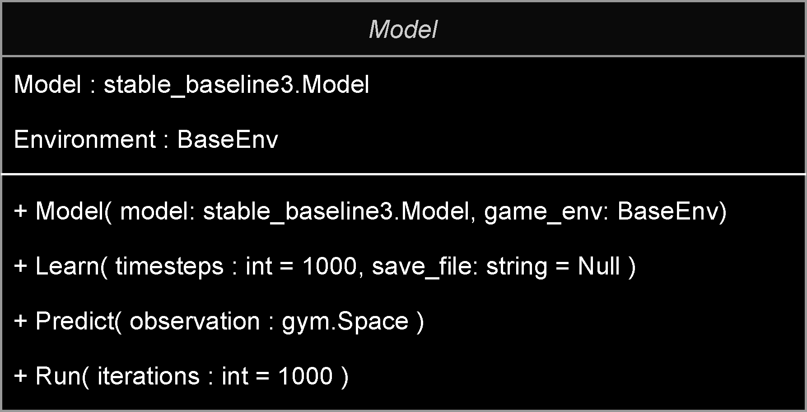
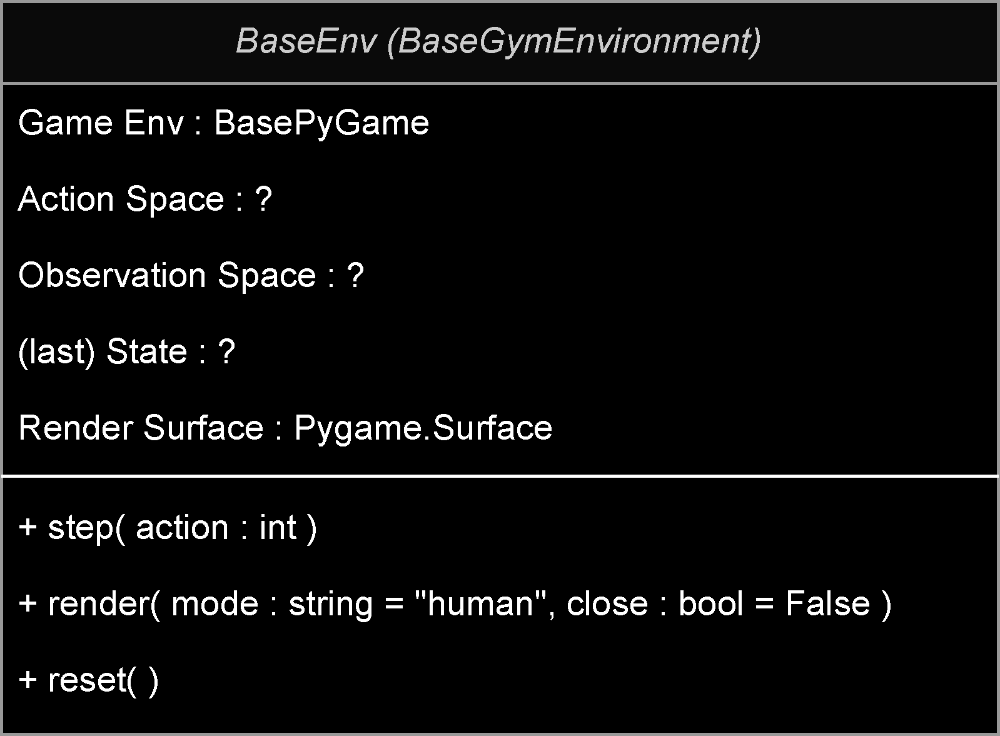
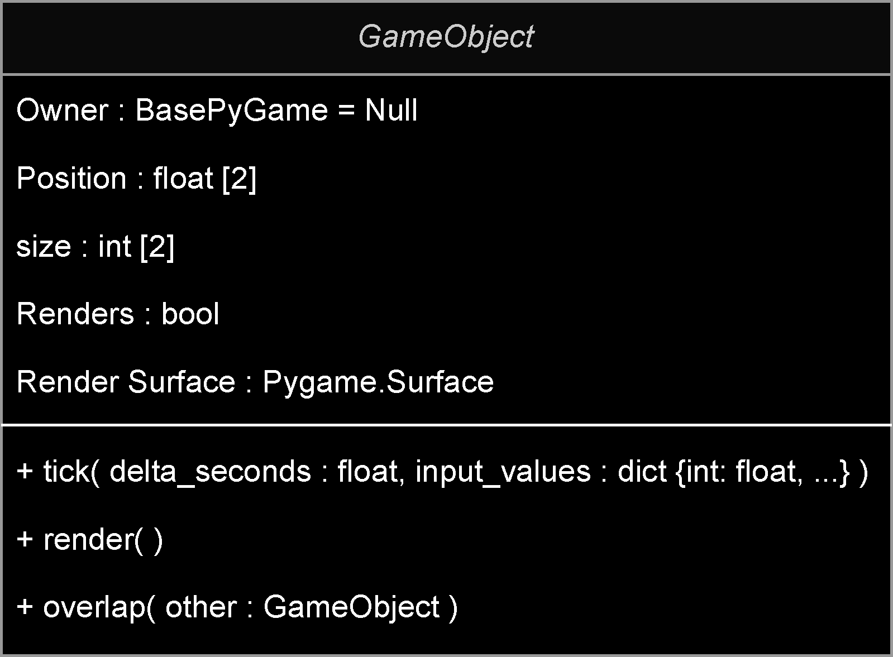
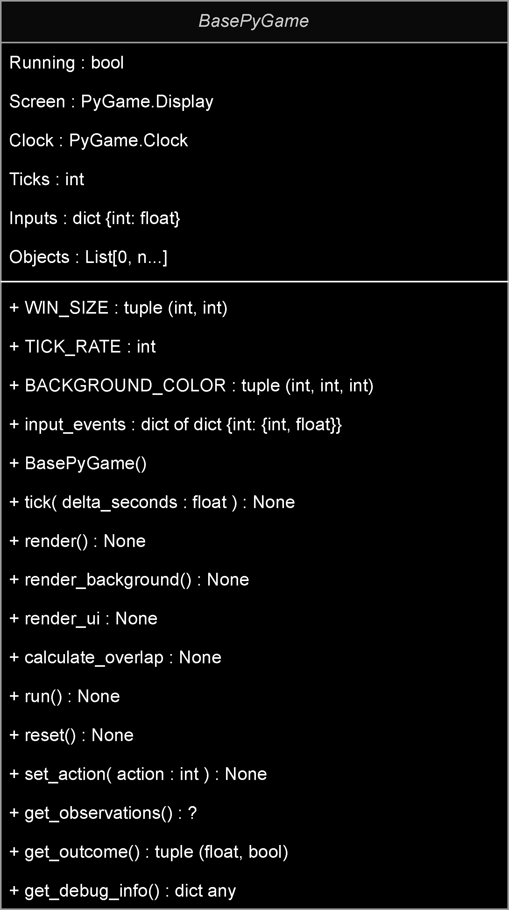
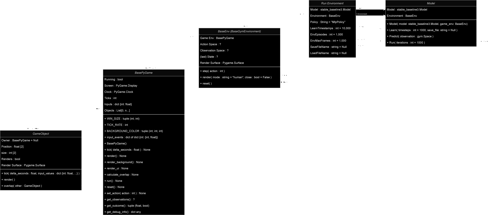

# Creating a simple framework/wrapper for PyGame, OpenAiGym and stable baseline 3
#### Entry: , Published: 

| 
[Return to index](../)
| 

While it's all well and good getting one of the example projects included in OpenAI Gym working, I ideally want to implement my own games for the ML agents to master. However, there are still a couple of things I don't understand about OpenAi Gym, namely, defining the action and observation space. Furthermore, I also had to work out how to structure the application, in a way that makes it reusable. Trying to work out both at the same time was a little overwhelming so I broke it down into two differ tasks. The first was to work out a logical structure then worry about the action and observation space latter.
 
I started with making a simple wrapper class for the stable_baseline3 ML Models which is constructed along with the OpenAi Environment then ``stable_baseline3`` models passed in as parameters. Then i implemented three different methods, to either extend or simplify the default behaviour to better suit my needs. This includes a ``learn`` method, witch simply starts the learning process with an added line of code to optionally save the model for later use once complete. Then there the ``predict`` method that just returns the predicted action base on the current observation, unlike the default behaviour of the stable_baseline3 model ``predict`` method which returns the predicted action and next state; however we don't have a use for the next state so we discard it. Finally, the ``run`` method, which is used to evaluate the trained model by ticking the OpenAi Gym environment for ``n`` amount of iterations or until the environment is completed (either from success or death) [[Fig. 1](#f1)].
 

 
[Fig. 1. Shows the Model class layout]

 
Next up was to implement a ``Base Gym Environment``, I know I must implement the 2 methods mentioned in the previous post plus an additional method to render the environment. However, I was unsure how to go about implementing the ``PyGame`` aspect. Should I implement PyGame as part of the ``Base Gym Environment`` or should I make a ``Base pyGame`` class and pass it into the ``Base Gym Environment``?
 
Eventually I decided to keep the ``pyGame`` separate and pass it into the ``Gym Environment`` essentially turning the ``Gym Environment`` into an ``AI warper for PyGame``. The upside to this, is it helps to keep the AI and human logic separate, however it does mean that you must implement additional method into the ``pyGame`` instance for the AI, such as ``set_action``, ``get_outcome`` and ``get_observaition``. Then in the ``Base Gym Environment`` is just a case of calling the necessary method on the pyGame, passing in what the AI predicts, also getting the outcome and observations [[Fig. 2](#f2)].
 

 
[Fig. 2. Shows the BaseEnv Class layout]

 
Now I could start thinking about implementing a simple structure for ``PyGame``, adding 2 base classes.
 
1. ``GameObject``  
  The gameObject simply defines the object's position and scale in the game and also contains the render texture which is cached to prevent any unnecessary draw calls. It further implements 3 virtual methods (which are optional), ``tick``, ``render`` and ``overlap``. Tick is called every frame to update the object, while render updates texture is necessary returning it to be blit-ed to the screen. Overlap on the other hand is used to calculate if two GameObjects are overlapping [[Fig. 3](#f3)].
 

 
[Fig. 3. Shows the GameObject class layout]

 
2. ``BasePyGame``
  ``BasePyGame`` is responsible for handling the game environment, with methods for defining the basic ``PyGame`` configuration, including ``Window size``, ``Tick rate`` and ``Input Events``.
  I then added a list for all the ``GameObjects`` to be registered into, along with a ``tick`` and ``render`` method and a further optional ``calculate overlap`` method. ``Tick`` simply iterates over the registered ``GameObjects``, once all objects have been ticked, calculate overlap is called for further processing.  
  On the other hand, ``Render`` clears the screen, renders the background (which is a virtual method), iterates over the registered ``GameObjects``, blit-ing there texture to screen and finally renders the UI (which is another virtual method). The reason for having separate tick and render methods is so they can be mapped to the ``OpenAi Gym Environment``.  
  I then added a ``Run`` method so humans can play the game too. The ``Run`` method pretty much just handles the ``PyGame`` events, such as ``Quit`` and ``inputs`` as well as making a call to tick and render. Lastly it implements the ``PyGame Clock`` to enforce the frame rate [[Fig. 4](#f4)].
 

 
[Fig. 4, Shows the BasePyGame Class layout]

 
Now i had an implementation for ``PyGame`` which was only really useable by humans, so i needed to add a few optional methods for ``Ai Gym`` so I naturally just add a few virtual methods for ``set action``, ``get observations``, ``get outcome`` and ``get debug info``.
- ``Set action`` is used to convert the AI action into the equivalent ``key press``
- ``get observations`` returns the current state of the environment
- ``get outcome`` returns the reward for the last action and whether we are done.
- ``get debug info`` just returns a dictionary of data that can be used for debugging.
 
Finally, it's just a case mapping those four methods to the ``Ai Gym Environment`` which is fairly straight forwards. Now I just need to pull it all together, for this i implemented a simple generic method, which takes the ``Ai Gym Environment`` ``stable_baseline3 model``, ``policy``, ``learn_timesteps``, ``environment episodes``, ``environment max frames``, ``save_file_name``/``load_file_name`` as params. I also added params for ``model_kwargs`` and ``load_kwargs`` as some of the parameters can vary between the different ``stable_baseline3 models`` .
 
Now it should just be a case of creating a ``pyGame`` passing that into the ``Gym Environment`` on construction, then passing that into the ``Model`` object along with the ``stable_baseline3`` model of our choosing. We end up with an application structure as depicted in [[Fig. 5](#f5)], however I am yet to implement a game and figure out how to map the ``Ai Gym`` action and observation space to the environment along with how to define the rewards.
 

 
[Fig. 5, Shows the entire struct of the application]

 

| 
[Return to index](../)
| 

 
 

