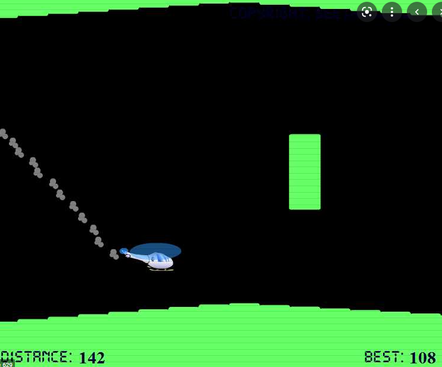

## Implementing a game and wiring up the AI
#### Entry: <span id="index"></span>, Published: <span id="published"></span>

<span class="priv_entry" style="display: inline;"></span>
| 
[Return to index](../)
| 
<span class="next_entry" style="display: inline;"></span>


I wanted to make something relatively simple for my first game, so I decided to make a clone of the classic ``Helicopter Flash Game`` [[fig. 1](#f1)]. The game consists of a single input and a grid based world to generate the cave [[Fig. 2](#f2)] and I throw in a collectable for good measure. I gathered that this would be a relatively simple game to implement and therefor a good starting point to work out how to map the action and observation space.

<p style="text-align: center;" id="f1">

<br />
[Fig. 1. Image of classic helicopter flash game]
</p>
<p style="text-align: center;" id="f2">

<br />
[Fig. 2. Image of My PyGame helicopter game]
</p>
In a tutorial we were given in a workshop as university, we were given a couple of hints towards different spaces that can be defined in OpenAi Gym, namely ``Discrete`` and ``Box`` spaces. It suggested that ``Discrete`` was for a fixed amount of actions while Box was for continues spaces. However that didn’t really mean much to me, but it was a good starting point for some research, which lead me to the OpenAi Git repo [folder containing the space classes](https://github.com/openai/gym/tree/master/gym/spaces). The repo further introduced a few other types of spaces, namely ``Tuple`` and ``Dict`` (or Dictionary). However, this sill didn’t mean much to me and just added to the confusion, until I stumbled across the ([Blackjack](https://github.com/openai/gym/blob/master/gym/envs/toy_text/blackjack.py)) environment, which had a really good description of the ``Discrete`` space along with an example use of the ``Tulpe`` space. In the blackjack environment they defined there actions as ``Discrete(2)`` since it had two actions ``stick`` and ``hit`` and then they defined three other Discretes for the observation space containing the total number of states. Here, I realized that ``Discrete`` was to defined a fixed number of states and therefor I should define my action space as ``Discrete(2)`` as there are two actions that the AI agent can makes (either press space or not press space). 

Lastly, to gage an understanding for the ``Box`` space, I explored several Git repos, finding the ``CartPole`` example the most useful. They define there observation space as a box with four min/max ranges. the first for cart position, second for the cart velocity, third for the pole angle and the last for the pole angular velocity. This made me think that the ``Box`` space would be good for the collectables position in the helicopter game since it continually moves towards the player within a particular range along the X and Y axis.

The description for the observation space in Blackjack also help me understand the ``Tuple`` since they defined it will 3 discretes, one for the players current sum, another for card the dealer is showing and the last representing a usable ace. A little more research made me realize that ``Dict`` spaces are pretty much the same except with keys (or "labels") witch I found to be more appealing, since I can add meaning to the values in code. 

This led me to believe that I should define my observation space as a ``Dict`` with three keys/value pairs.
```python
observations_space = {
  "Player position": Discrete(2), # discrete for X and Y
  "Goal Position": Box( [x_min, y_min], [x_max, y_max] ), # witch two ranges (1 for X pos and other for Y pos
  "Obsterical Space": Tuple( ( Discrete(2), ...) ) # One discrete for each cell, 0 = no collider 1 = collider)
}
```

However, this just didn’t work, I mean it wouldn’t even run at all. It turns out that you can’t nest ``Tuple`` spaces inside of ``Dict`` space with ``stable_baseline3`` (although there are other libraries that do support it). At this point I just wanted to so if it could learn something, so I decided to disable the collisions on obstetrical in the game and comment out the ``goal position`` and ``obstacles`` in the observation space. Therefor it would give me a bit of time to come up with a solution for nested tuple issues. Furthermore, it would make it a little bit easier to debug if nothing where to happening. So, I decided to use ``Deep Q Network`` (DQN) model to train the agent with 100,000 training timesteps and it ran...

... Well for about a second, and... it **crashed**. Simply because I defined the ``player position`` as a discrete space with two values when the Y axis is in a continues range, while X position is fixed. With that realization I decided to change the ``player position`` to the a ``Box`` space with a single range for the Y position as the X position is practically useless as it’s a fixed position. So now the observation space is defined as

```python
observation_space = {
  "Player position": Box( [y_min], [y_max] ) # Continues space for player Y position
  # "Goal Position": Box( [x_min, y_min], [x_max, y_max] ), # witch two ranges (1 for X position and other for Y position
  # " obstacles Space":  Tuple( ( Discrete(2), ...) )
}
```

With these simple changes I ran it again with the previous settings and ...

## It actually done a thing
To my surprise, it worked! I honestly didn’t know what to expect when I hit play, but the helicopter managed to stay within the screen space (outside of the screen space was considered a death without the obstacles collisions enabled) However, the helicopter was extremely unstable and unable to fly in a straight line, no matter how much training [[Fig. 3](#f3)].

<p style="text-align: center;" id="f3">

<br />
[Fig. 3, First flight]
</p>

<br />
<br />

<span class="priv_entry" style="display: inline;"></span>
| 
[Return to index](../)
| 
<span class="next_entry" style="display: inline;"></span>

<br />
<br />

<script>
// Store the entry id and published values in a JS script, to make life easier with updateing links.
entry_id  = 3
published = "11-02-22" 
week = 3

document.getElementById("index").innerHTML = entry_id
document.getElementById("published").innerHTML   = `${published} (Week: ${week})`


next_page = "journal_"+ (entry_id + 1)
priv_page = "journal_"+ (entry_id - 1)

next_links = document.getElementsByClassName("next_entry")
priv_links = document.getElementsByClassName("priv_entry")

// atempt to fetch the next page. 
// if we get an ok responce display the next links, 
// otherwise we have most likely reaced the end.
fetch('./'+next_page+'.html')
    .then (
        responce => {
        if ( responce.ok ) 
            for ( let i in next_links )
                next_links[i].innerHTML = '<a href="./'+next_page+'">Next ></a>'
        }
    )

// only display the priv page link if we have gone past the first page.
// theres no need to fetch the prv page, since we know the min id is 0
if (entry_id > 0)
    for ( let i in priv_links )
        priv_links[i].innerHTML = '<a href="./'+priv_page+'">< Priv</a>'


</script>