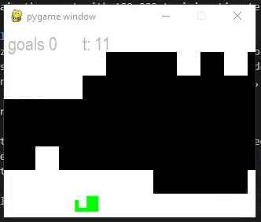
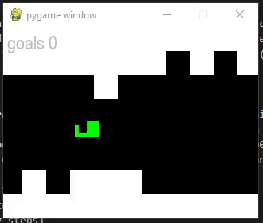
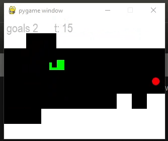
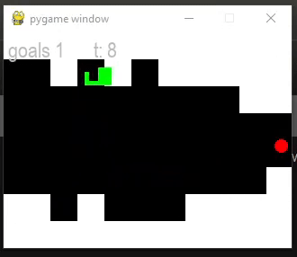
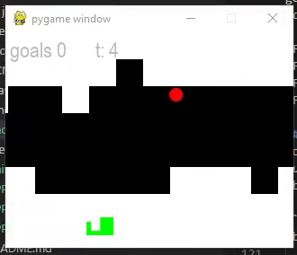
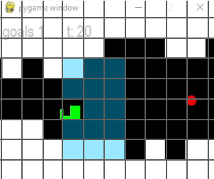
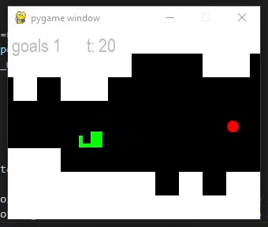

## Adding the other bits
#### Entry: <span id="index"></span>, Published: <span id="published"></span>

<span class="priv_entry" style="display: inline;"></span>
| 
[Return to index](../)
| 
<span class="next_entry" style="display: inline;"></span>


## The goal
Now it was time to introduce the ``Goal`` and I trained it again with DQN increasing the training timesteps to 175,000 as I found it performed better while experimenting without goals. To be honest I felt like it was making an effort to collect the goals however it wasn’t quite getting there [[Fig. 1](#f1)]. So I went about increasing the training steps to 250,000 witch had a positive effect in terms of collecting goals, however it now starting to fall out-side of the screen bounds and consequently die [[Fig.2](#f2)]. So I thought I would increase the training steps further to 350,000 to see if it made any improvement, to which it collected pretty much ever goal and to my surprise it was slightly more stable [[fig. 3.1](#f3_1)]. I mean it was still unstable but it was staying more within the screen bounds and better lining up with goals [[Fig. 3.2](#f3_2)].

<p style="text-align: center;" id="f1">

<br />
[Fig. 1, Making a effort to collect goals after 175,000 training steps]
</p>
<p style="text-align: center;" id="f2">

<br />
[Fig. 2, Starting to collect goals after 250,000 training steps]
</p>
<p style="text-align: center;" id="f3_1">

<br />
[Fig. 3.1, After 350,000 training steps]
</p>
<p style="text-align: center;" id="f3_2">

<br />
[Fig. 3.2, After 350,000 training steps]
</p>


## Stabilizing the helicopter
Now I want to see if I could stabilize the helicopter and I gathered that it had no context for how fast it was rising or falling, it just knows about its vertical position within the screen space. So, this made me wonder if adding the helicopters vertical speed to the observation space would help stabilize it.

```
observation_space = {
  # ...
  "speed": gym.spaces.Box( [-9], [9], dtype=np.float )
  # ...
}
```

Following the change, I trained the agent once more using DQN and 175,000 training steps, since this seems to be my baseline timesteps from the previous runs, before it learns something meaningful. And it seemed to of worked [[Fig.4.1](#f4_1)], it wasn’t perfect by any means, but it was stable and going for the collectables. However, it would still sometimes go out of bounds, although that is consistent will out previously runs at 175,000 timesteps. So, I thought I would try out the higher value of 350,000 timesteps, before moving onto the obstacle space. However, this appeared to have a negative effect [[Fig 4.2](#f4_2)], I guess it had overfitted the dataset.

<p style="text-align: center;" id="f4_2">

<br />
[Fig 4.1 Show how add the vertical speed to the observation space stabilized the helicopter, after 175,000 timesteps.]
</p>
<p style="text-align: center;" id="f4_2">

<br />
[Fig 4.2 Show how add the vertical speed to the observation space stabilized the helicopter, after 350,000 timesteps.]
</p>

At this point I probably should of started experimenting with the learning rate, game and rewards, but I was just focused on getting the observation space working and therefor slipped my mind.

## Adding obstacles
So now the time came to implement a solution for the avoid obstacles. what I did know, is each cell can be in one of two states and ``discrete`` spaces are ideal for that. So I took the obvious solution and just decided to add a key to the ``Dict`` space for each block with a value of ``Discrete(2)``. I guessed there must be a better solution for this, however I still just wanted to get it working, so it'll do for now. Furthermore, we had briefly discussed state space, basically the larger it gets the more training that is required and I wanted to be mindful of this. So I went about limiting the AI view of the environment to 2 cells above/below its current position and 3 cells in front of its current position [[Fig 5](#f5)] (which is a bit unfair on a reflection). 

```python
observation_space = {
  "Player position": Box( [y_min], [y_max], dtype=np.float )
  "speed": Box( [min_y_speed], [max_y_speed], dtype=np.float ),
  "Goal Position": Box( [x_min, y_min], [x_max, y_max], dtype=np.float ), 
  "Obstacle1": Discrete(2) 
  "Obstacle2": Discrete(2) 
  "Obstaclen": ...
}
```
[The observation space after adding obstacles]

<p style="text-align: center;" id="f5">

<br />
[Fig 8. shows the space viewable to the ai, highlighted in blue ]
</p>
So now it was time to see if it could learn to avoid the obstacle cells. Therefore, I set it off to learn for 175,000 timesteps using ``DQN``. To be far, it done quite a good job at avoiding the obstacle cells and it seemed to be getting the hang of collecting the goals [[fig.6](#f9)].

<p style="text-align: center;" id="f6">

<br />
[Fig 5. Show the agent avoiding the obstacles]
</p>

<br />
<br />

<span class="priv_entry" style="display: inline;"></span>
| 
[Return to index](../)
| 
<span class="next_entry" style="display: inline;"></span>

<br />
<br />

<script>
// Store the entry id and published values in a JS script, to make life easier with updateing links.
entry_id  = 4
published = "14-02-22" 
week = 4

document.getElementById("index").innerHTML = entry_id
document.getElementById("published").innerHTML   = `${published} (Week: ${week})`


next_page = "journal_"+ (entry_id + 1)
priv_page = "journal_"+ (entry_id - 1)

next_links = document.getElementsByClassName("next_entry")
priv_links = document.getElementsByClassName("priv_entry")

// atempt to fetch the next page. 
// if we get an ok responce display the next links, 
// otherwise we have most likely reaced the end.
fetch('./'+next_page+'.html')
    .then (
        responce => {
        if ( responce.ok ) 
            for ( let i in next_links )
                next_links[i].innerHTML = '<a href="./'+next_page+'">Next ></a>'
        }
    )

// only display the priv page link if we have gone past the first page.
// theres no need to fetch the prv page, since we know the min id is 0
if (entry_id > 0)
    for ( let i in priv_links )
        priv_links[i].innerHTML = '<a href="./'+priv_page+'">< Priv</a>'


</script>